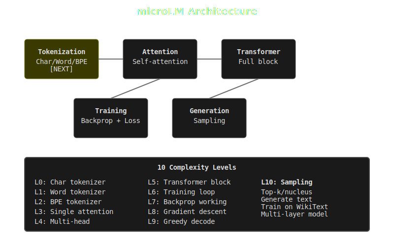

# nuLLM

A minimal LLM built from scratch in Python. On-system Claude alternative - no API costs.



## Status
**Phase 1-5 Complete**  - All core components implemented and tested
- Tokenization: Char, word, BPE 
- Attention: Multi-head, scaled dot-product 
- Transformer: Full stack with residuals 
- Training: Loss function, optimizer, training loop 
- Generation: Autoregressive sampling with temperature 
- Chat: Conversational AI interface 

## Goals
- Tokenize text (BPE/WordPiece)
- Build transformer architecture (attention, feed-forward, layernorm)
- Train on small corpus
- Generate coherent text

## Setup
```bash
cd nuLLM
python3 -m venv venv
source venv/bin/activate
pip install -r requirements.txt
```

## Quick Test
```bash
python examples/quick_test.py
```

## Train
```bash
python src/train.py
```

**Note**: Requires PyTorch. If not installed:
```bash
pip install torch
```

## Documentation
- [ROADMAP.md](ROADMAP.md) - Development phases
- [BENCHMARKS.md](BENCHMARKS.md) - Complexity tiers
- [ARCHITECTURE.md](ARCHITECTURE.md) - Model design

## Author
Joshua Trommel (nulljosh)
