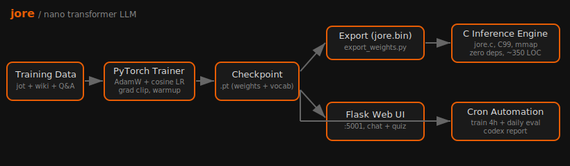

# aether

A small language model built from scratch. Trained on code and knowledge.



## What It Does

Generates text based on a prompt. Understanding how it works teaches you how real language models work.

## Getting Started

```bash
git clone https://github.com/nulljosh/aether.git && cd aether
python -m venv venv && source venv/bin/activate
pip install -r requirements.txt

# Generate text
python src/generate.py --prompt "fn " --temperature 0.3

# Web interface (chat)
python web_ui.py
# Visit http://localhost:5001
```

## How It Works

1. **Data** -- Train on math, current events, and Wikipedia
2. **Model** -- Small transformer neural network (445K parameters)
3. **Learning** -- PyTorch training with character-level tokenizer
4. **Output** -- Predicts next tokens based on patterns learned

## The Numbers

- Parameters: 445K (vs Claude: billions)
- Training time: Minutes on CPU
- Vocab: 91 characters
- Layers: 3 transformer blocks with attention
- Speed: CPU inference

## Why Build It

Understanding language models means building one. This is the simplest version that actually works.

## Architecture

See `architecture.svg` for detailed model structure.

## License

MIT 2026 Joshua Trommel
