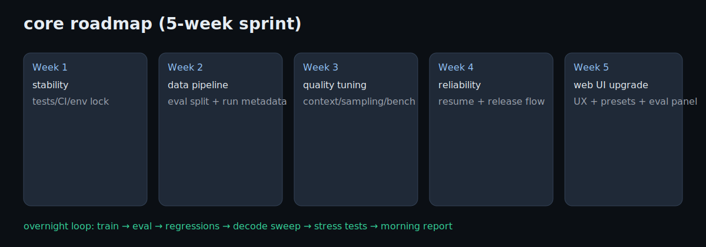

# core

Tiny transformer LM built from scratch in PyTorch.

TLDR:
- Train on text/code corpora
- Generate syntax-aware completions
- Keep it small, fast, and understandable

## Quick start

```bash
python3.13 -m venv venv
source venv/bin/activate
pip install -r requirements.txt

pytest -q
python3 src/train.py --epochs 100 --corpus tiny
python3 src/generate.py --prompt "func add" --length 80
```

## Optional `.env`

```env
MODEL_PATH=models/ultra.pt
DATA_PATH=data/ultra_minimal.txt
PORT=5001
DEBUG=True
```

## Web UI

```bash
python3 web_ui.py
```

- http://localhost:5001/
- http://localhost:5001/quiz
- Controls: prompt, length, temperature, top-k, top-p
- API endpoints:
  - `POST /api/generate` (also available at `POST /generate`)
  - `GET /api/status` (also available at `GET /status`)

Optional env vars (defaults shown):

```env
MODEL_PATH=models/ultra.pt
DATA_PATH=data/ultra_minimal.txt
PORT=5001
DEBUG=false
```

## Project layout

- `src/train.py` — train loop + generation helpers
- `src/generate.py` — inference entry point
- `src/model.py` — transformer model
- `src/tokenizer.py` — tokenization
- `data/` — datasets
- `models/` — checkpoints
- `tests/` — pytest suite

## Architecture


## Roadmap + ETA



- Week 1: stability (tests/CI/env lock)
- Week 2: data pipeline + eval split + run metadata
- Week 3: quality tuning (context/sampling/bench prompts)
- Week 4: reliability + release flow
- Week 5: web UI upgrade (better UX, prompt presets, run/eval panel)

MVP ETA: ~4 weeks focused.

## Overnight run plan (Claude-like direction)

- Long train run on mixed corpus (code + reasoning + dialogue)
- Checkpoint every N steps + periodic sample generation
- Fixed eval pack each checkpoint (reasoning, code, debug, summarize, instruction-follow, refusal)
- Regression gate: block checkpoints that degrade syntax/following quality
- Decode sweep: temperature/top-k/top-p grid to pick best defaults
- Error stress: empty prompt, long prompt, unicode, bad params, missing files
- UI/API smoke: `/api/status` + `/api/generate` valid/invalid payloads
- Morning report: best checkpoint, deltas, wins/fails, next tuning steps

## Opus replica reality check

- True Opus parity: not realistic solo.
- Strong domain mini-Opus:
  - v1: 1-2 months
  - strong system: 3-6 months

## Notes

Educational + experimentation repo. For production behavior, scale model/data/training stack significantly.
